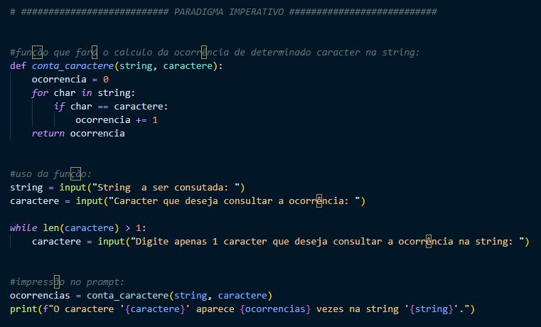
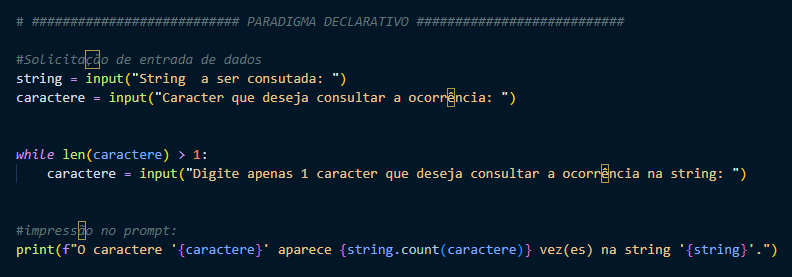
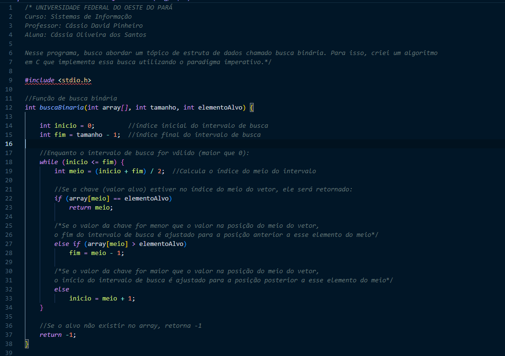
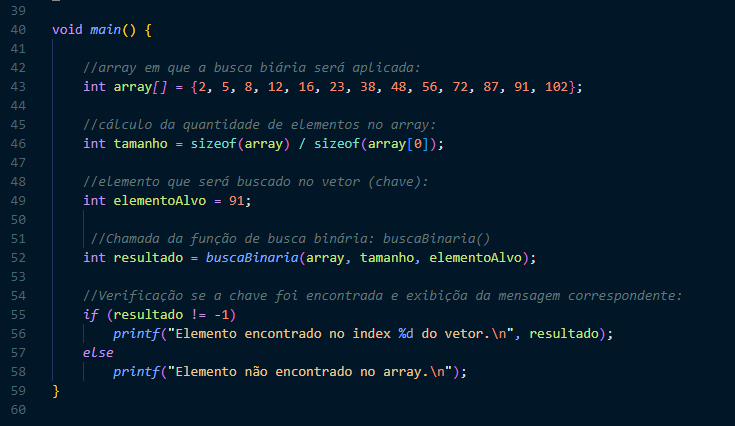
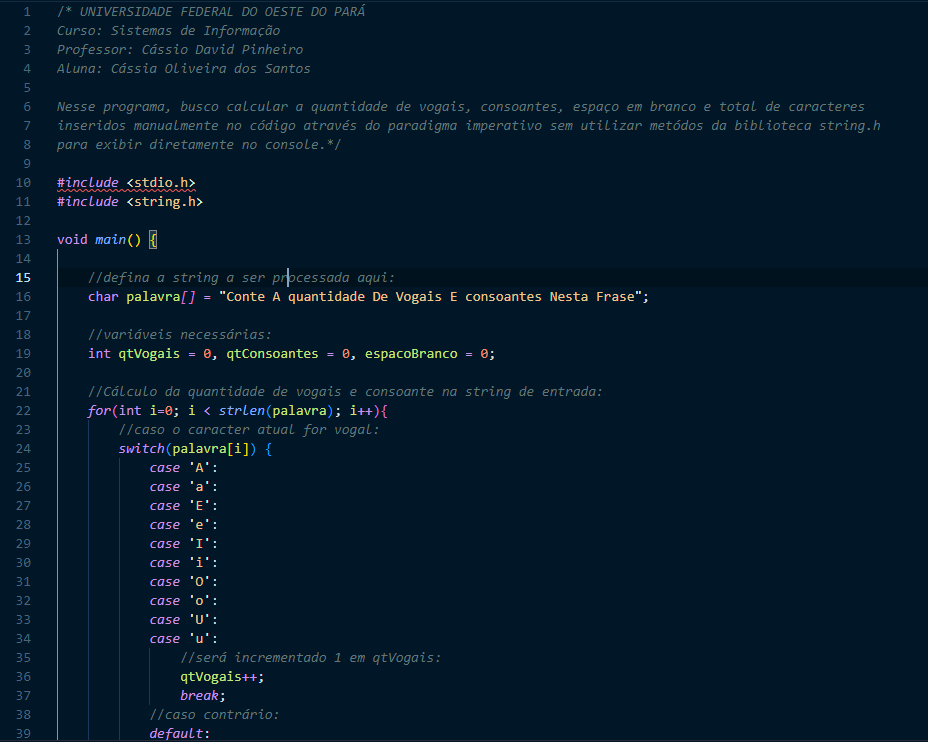
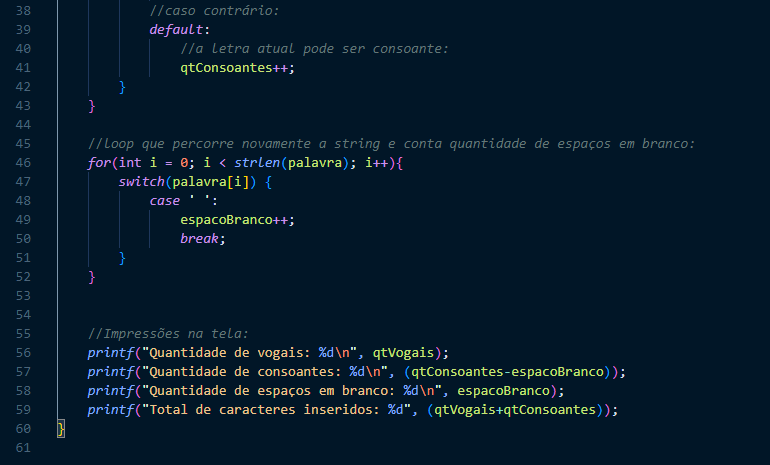
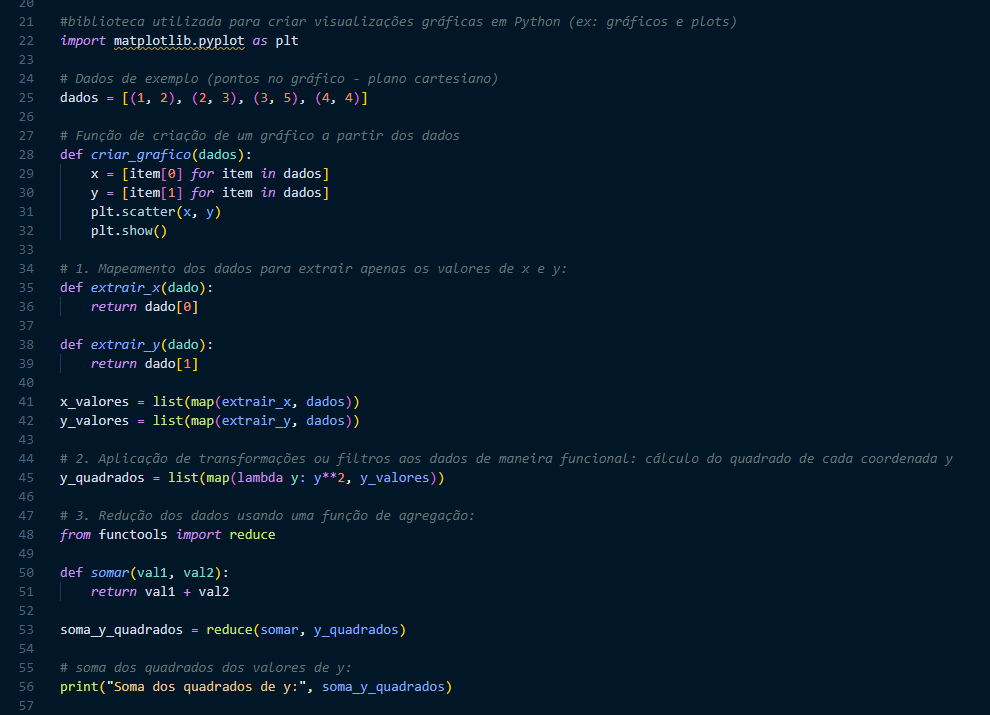

<h2>Conteúdos abordados e projetos desenvolvidos até o momento:</h2>

<h4>1. Paradigmas de programação:</h4>
<h6>- Imperativo / Procedural: <a href="https://github.com/CassiaSantos/portifolioProjetos_Laboratorio-de-programacao/blob/main/fatorialPorRecursividadeEmC.c">Cálculo recursivo do fatorial de um número na linguagem C</a>;</h6>
<h6>- Funcional: ;</h6>
<h6>- Orientado a Objetos: <a href="https://github.com/CassiaSantos/portifolioProjetos_Laboratorio-de-programacao/tree/main/Pizzaria">Estrutura de uma pizzaria</a>;</h6>
<h6>- Declarativo: <a href="https://cassiasantos.github.io/Jazz-School-Toms_LandingPage/">Página Landing Page para uma escola musical fictícia</a>;</h6>

<h4>Programação Imperativa Vs Declarativa.</h4>

<h2>1ª avaliação:</h2>
Para a primeira avaliação, fiz 2 algoritmos em python que calculam a ocorrência de um caracter em uma dada string. Em 1 algoritmo procurei utilizar o paradigma Imperativo e em outro o paradigma declarativo.
Veja o código nas imagens abaixo:

Ambos os algoritmo recebem uma string e um caractere e retorna o número de vezes que esse caractere aparece na string.

<h3>Paradigma imperativo:</h3>

Com o algoritmo abaixo, quero apresentar características do paradigma imperativo, onde o passo a passo da solução do problema é especificado pelo programador no código para a máquina. Escolhi fazer este passo a passo na função conta_caractere() pois acho que fica mais organizado a escrita do código. É nela (linhas 15-20 do arquivo) que se pode visualizar a processo de contagem dos caracteres.

<h3>Paradigma declarativo:</h3>

Com este algoritmo, quero apresentar características do paradigma DECLARATIVO, que tem como foco a solução do problema, sem se preocupar como o passo a passo será implementado pelo computador. Essa caraterística pode ser vista na linha 25 do arquivo, através da chamada da função count(), nativa de Python, pois ela conta quantas vezes um determinado substring (ou caractere) ocorre na string principal e retorna o resultado. Logo, não é preciso que o programador especifique o passo a passo, somente chame a função.

<h2>2ª Avaliação:</h2>

Para a segunda avaliação, busquei implementar algoritmos de temas abordados em sala de aula nos paradigmas estudados.

<h3>Problemas em Paradigmas Imperativos: Estruturas de Dados</h3>

O algoritmo que mais gostei de desenvolver foi o de busca binária em C utilizando o paradigma imperativo. Nele, é passado um vetor ordenado, seu tamanho e o valor que se deseja pesquisar no vetor (chave). Assim, ele faz chegagens do valor mais próximo do meio do vetor em busca da chave e alterando o intervalo de busca conforme o valor do meio do vetor. Você pode ver código clicando nas 2 próximas fotos:

<h3>Problemas em Paradigmas Funcionais: Processamento de Strings</h3>

Nesse algoritmo, busco calcular a quantidade de vogais, consoantes, espaço em branco e total de caracteres inseridos manualmente no código através do paradigma imperativo sem utilizar metódos da biblioteca string.h para exibir diretamente no console.

 
 

<h3>Problemas em Paradigmas Funcionais: Geometria Computacional</h3>

Nesse algoritmo, procuro reescrever para o paradigma funcional um programa em Python criado para apresentar um gráfico de dados. Aqui, o foco é na manipulação dos dados e não na exibição do gráfico.

 